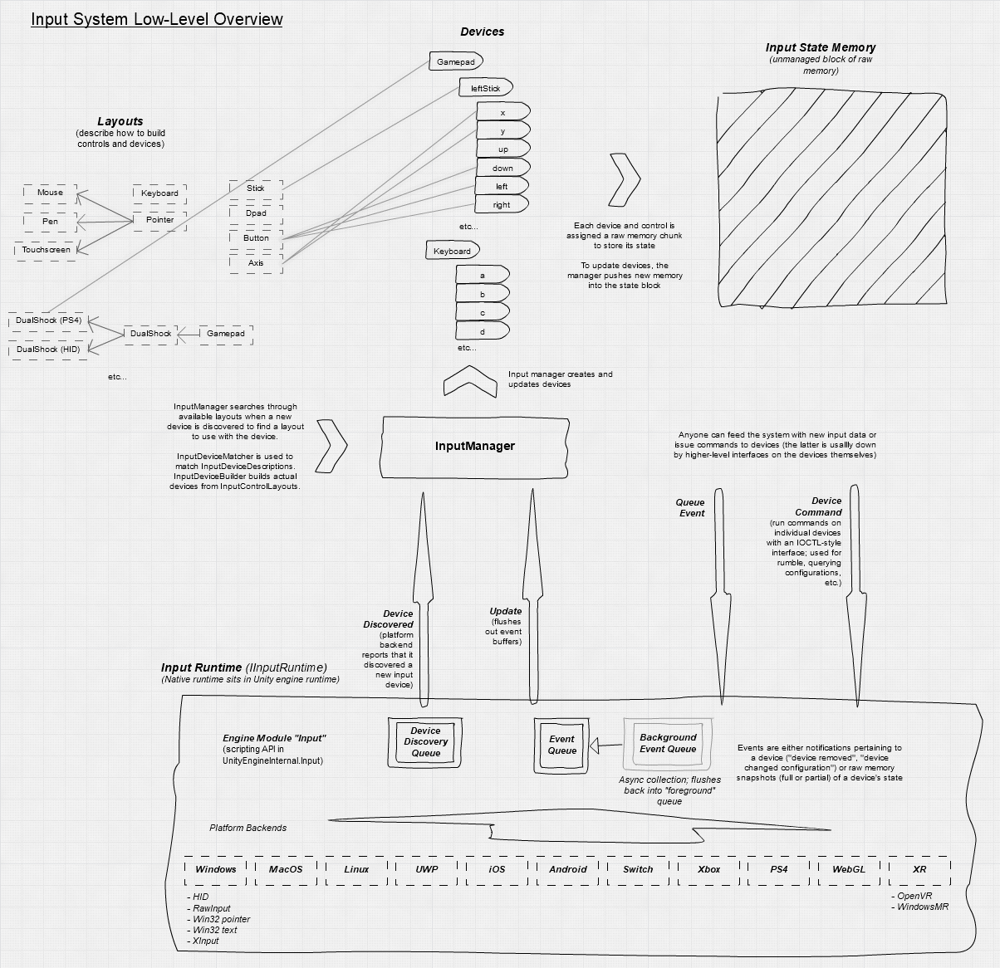

# Architecture

The input system has a layered architecture. Principally, it divides into a low-level and a high-level layer.

# Low-Level

## Runtime

The `IInputRuntime` interface represents the "input backend" that generates input for the current platform. By default, the runtime is tied to `UnityEngineInternal.Input.NativeInputSystem` and uses per-platform backends implemented natively in the Unity engine runtime.

# High-Level

# Plugins

The input system comes with a range of features that are implemented on top of the core input system features. All of these features are optional and are implemented as self-contained units considered to be "plugins". The public APIs of these modules are all under the `UnityEngine.Experimental.Input.Plugins` namespace.

|Plugin|Description|
|------|-----------|
|`Android`||
|`DualShock`|Support for PS4 DualShock controllers.|
|`HID`|Adds support for generic HID devices. Note that even without this plugin, HID devices can be used. They will, however, require dedicated device layouts in order to be recognized. The HID plugin adds the ability to generate device layouts on the fly from the information found in HID descriptors. The most important contribution is generic support for joysticks.  This plugin is only supported on platforms that support HID. See [HID-specific documentation](HID.md) for details.|
|`iOS`||
|`Linux`||
|`OnScreen`|Providers support on-screen controls that simulate input from UI elements. See [documentation](OnScreen.md).|
|`PlayerInput`|Adds the `PlayerInput` and `PlayerInputManager` MonoBehaviour components that provide a high-level, easy-to-use wrapper of the input system. See [documentation](Components.md).|
|`PS4`||
|`Steam`||
|`Switch`|Support for the Nintendo Switch platform. Principally contributes support for the Switch gamepad (`Npad`) described in further detail [here](Gamepad.md#switch).|
|`EnhancedTouch`|High-level support for working with touches. See [documentation](Touch.md).|
|`UI`|Support for using the Unity in-game UI system in combination with the input system. See [documentation](UISupport.md).|
|`Users`|User management that handles device-to-user pairing. See [documention](UserManagement.md).|
|`WebGL`||
|`XInput`|Support for XInput-compatible devices.|
|`XR`||

## Suppressing Default Plugin Registration

By default, the input system will register all of the built-in plugins that are applicable to the current platform. This behavior can be suppressed by defining the `UNITY_DISABLE_DEFAULT_INPUT_PLUGIN_INITIALIZATION` scripting define for your project.
