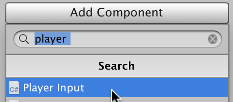
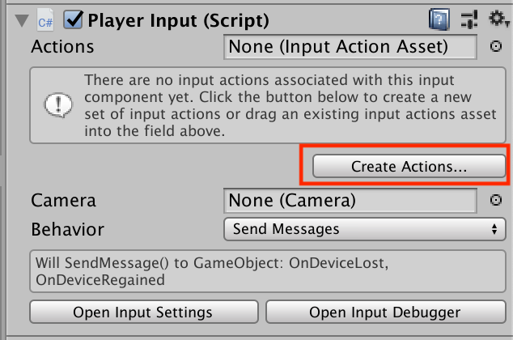
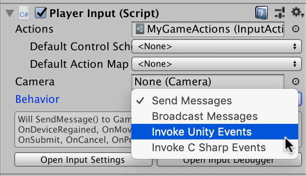
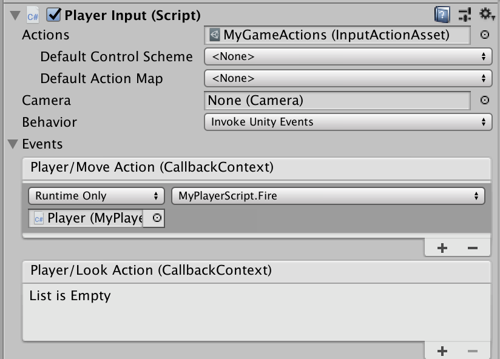

>NOTE: For information on how to install the new input system, please see [Installation](Installation.md).

# Quick Start Guide

* [Getting Input Directly From An Input Device](#getting-input-directly-from-an-input-device)
* [Getting Input Indirectly Through An Input Action](#getting-input-indirectly-through-an-input-action)

## Getting Input Directly From An Input Device

The quickest way to get started in script is to just read the current state directly from input devices. For example, the following code grabs the gamepad last used by the player and reads out its current state:

```CSharp
using UnityEngine;
using UnityEngine.Experimental.Input;

public class MyPlayerScript : MonoBehaviour
{
    void FixedUpdate()
    {
        var gamepad = Gamepad.current;
        if (gamepad == null)
            return; // No gamepad connected.

        if (gamepad.rightTrigger.wasPressedThisFrame)
        {
            // 'Use' code here
        }

        Vector2 move = gamepad.leftStick.ReadValue();
        // 'Move' code here
    }
}
```

The same approach works for other types of devices, e.g. [`Keyboard.current`](../api/UnityEngine.InputSystem.Keyboard.html), [`Mouse.current`](../api/UnityEngine.InputSystem.Mouse.html), etc.

## Getting Input Indirectly Through An Input Action

>Overview:
>1. Add `PlayerInput` component.
>2. Create actions with "Create Actions..." button.
>3. Script action responses.

### Step 1: Add [`PlayerInput`](Components.md) Component

Getting input directly from an input device is quick and convenient but requires a separate path for each type of device and also makes it hard to later change which control on the device leads to which action being taken by the game.

An alternative is to use actions as an intermediary between devices and the responses they trigger in the game. The easiest way to do so is using the [`PlayerInput`](Components.md) component. You can add the component from the "Add Component" menu in the GameObject inspector or by selecting `Component >> Input >> Player Input` in the main menu.



### Step 2: Create Actions

Each [`PlayerInput`](Components.md) component represents one player in the game. To receive input, the component must be connected to a set of actions. The quickest way to create a new set of actions is to click the "Create Actions..." button in the inspector of the component. This will create an asset prepopulated with a default set of maps, actions, and bindings.



A file requester will pop up that asks you where to create the new asset. Choose a name and folder somewhere inside the "Assets" folder of your project (or just accept the defaults) and click "Okay". This will create a new `.inputactions` asset in your project, connect it to the [`PlayerInput`](Components.md) component, and bring up the editor for `.inputactions` files.


The default set can be freely edited to fit the needs of your project. See the in-depth documentation for the [action editor](ActionAssets.md#editing-action-assets) for instructions on how to use the editor.

## Step 3: Setting Up Action Responses

With the actions in place on the compone nt, all that remains is to set up a response for each action. Through the "Behavior" setting in the inspector, [`PlayerInput`](Components.md) gives you several ways by which responses can be set up:



For more details about the options, see [here](Components.md#notification-behaviors). In our case, we will use "Invoke Unity Events" which uses `UnityEvent` the same way the Unity UI does. When selecting this option, an event for each action that is linked to the component will be displayed. This allows us to directly wire in the target method for each event.



Each method takes an [`InputAction.CallbackContext`](../api/UnityEngine.InputSystem.InputAction.CallbackContext.html) argument that gives access to things like the control that triggered the action and its value. See [here](Actions.md#started-performed-and-cancelled-callbacks) for more details.

```CSharp
public class MyPlayerScript : MonoBehaviour
{
    public void Fire(InputAction.CallbackContext context)
    {
        Debug.Log("Fire!");
    }
}
```

This completes the basic setup using [`PlayerInput`](Components.md).

### Alternate Ways to Set Up Input Actions

There are ways other than [`PlayerInput`](Components.md) to set up input actions. See the [documentation](Actions.md#creating-actions) for details.
