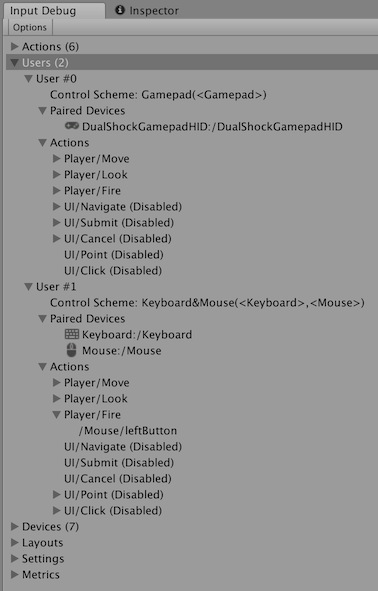

    ////WIP

# User Management

The input system supports multi-user management through a separate plugin. This comprises both user account management features on platforms that have respective capabilities built into them (such as Xbox and PS4) as well as features to manage device allocations to one or more local users.

>NOTE: The user management API is quite low-level in nature. If the stock functionality provided by `PlayerInputManager` (see [Components](./Components.md)) is sufficient, this provides an easier way to set up user management. The API described here is mainly for when more control over user management is desired.

## Device Pairing

### Initial Engagement

### Loss of Device

### Control Scheme Switching

### Rebinding

## User Account Management

## Debugging

>NOTE: This feature currently only works for local players and does not yet work for showing input users from connected/remote players.

In the editor, the currently active users along with their paired devices and active actions are shown in the input debugger during gameplay under "Users". To open the input debugger, select "Windows >> Input Debugger" from the main menu.

